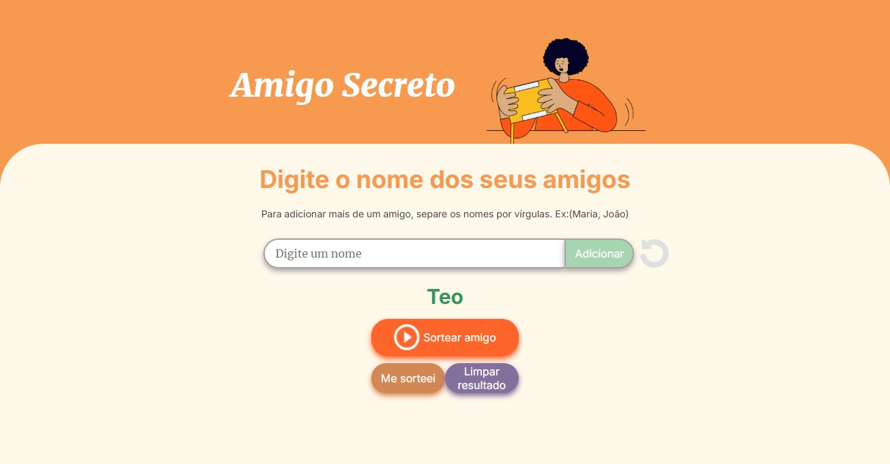
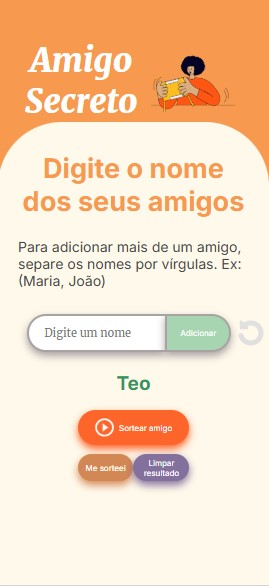
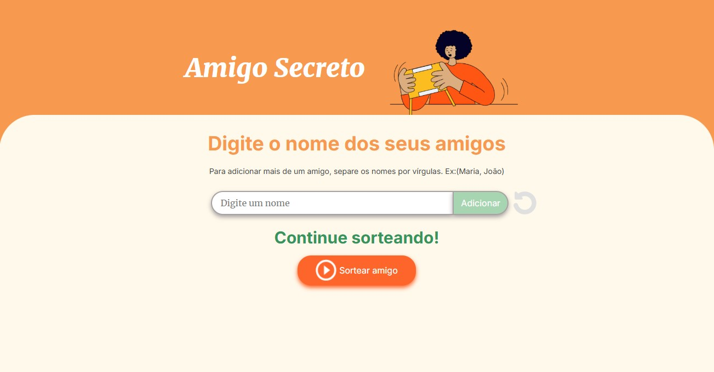
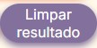

# Descrição

Este projeto é parte de um challenge do curso Oracle Next Education (ONE), realizado pela Oracle em parceria com a Alura, com o objetivo de capacitar talentos em tecnologia. 
Neste challenge estamos criando uma aplicação web para realizar o sorteio de um amigo secreto.

Acesse a aplicação através deste [link](https://fervassoler.github.io/amigo-secreto/) do GitHub Pages!

<br>
Tela inicial: web | mobile

  

<br>
Tela com lista de amigos: web | mobile

  

<br>
Tela após inicio do sorteio: web | mobile

  

<br>
Tela após limpar resultados: web | mobile

  

_______

## Funcionalidades

- **Adicionar amigos:** 
  - Ao clicar em "Adicionar" o nome do amigo inserido no campo irá aparecer em uma lista abaixo. 
  - Caso o campo de texto esteja vazio ou o nome já esteja na lista irá aparecer um alerta pedindo para digitar um nome válido.
  - Caso o nome possua caracteres diferentes de letras será exibido uma mensagem que o nome é inválido.
  - Caso deseje adicionar mais de um amigo por vez coloque os nomes dos amigos separados por virgula ex: (ana, maria, joao)
  <br><br>
<br>

- **Sorteio aleatório:** 
  - Ao clicar no botão "Sortear Amigo", um nome da lista será selecionado aleatoriamente e exibido na tela.
  - O sorteio termina quando todos os nomes da lista já tiverem sido sorteados.
  - Caso o nome sorteado seja o da própra pessoa, tem a possibilidade de resortear clicando n botão Me sorteei.
  - Caso o sorteio já tenha ocorrido ou ainda não tenha nenhum amigo adicionado irá aparecer um alerta pedindo para adicionar os nomes dos amigos.
  <br><br>
<br>

- **Reiniciar:**
Ao clicar no icone de reiniciar amigo secreto a lista de amigos será resetada para iniciar novamente a adição dos nomes para o sorteio.
<br><br>

- **Resortear:**
Ao clicar no botão "Me sorteei" será realizado um novo sorteio aleaório com os nomes restantes.
<br><br>

- **Limpar Resultado:**
Ao clicar no botão "Limpar resultado" o nome sorteado será apagado da tela.
<br><br>

_______

## Tecnologias Utilizadas

-  |  | 

_______

## Como Executar o Projeto

Acesse o [GitHub Pages](https://fervassoler.github.io/amigo-secreto/) deste projeto para testar a aplicação!

Para testar localmente siga os seguintes passos:
1. Clone o repositório:
    ```bash
    git clone https://github.com/fervassoler/amigo-secreto
    ```
2. Navegue até o diretório do projeto:
    ```bash
    cd amigo-secreto
    ```
3. Abra a página inicial:
    - No Linux ou Mac:
    ```bash
    open index.html
    ```
    - No Windows:
    ```cmd
    index.html
    ```
_______

## Contribuição

1. Faça um fork do projeto
2. Crie uma branch para sua feature:
    ```bash
    git checkout -b minha-feature
    ```
3. Commit suas mudanças:
    ```bash
    git commit -m 'Minha nova feature'
    ```
4. Faça um push para a branch:
    ```bash
    git push origin minha-feature
    ```
5. Abra um Pull Request
