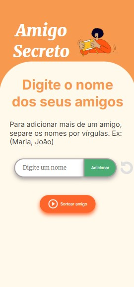
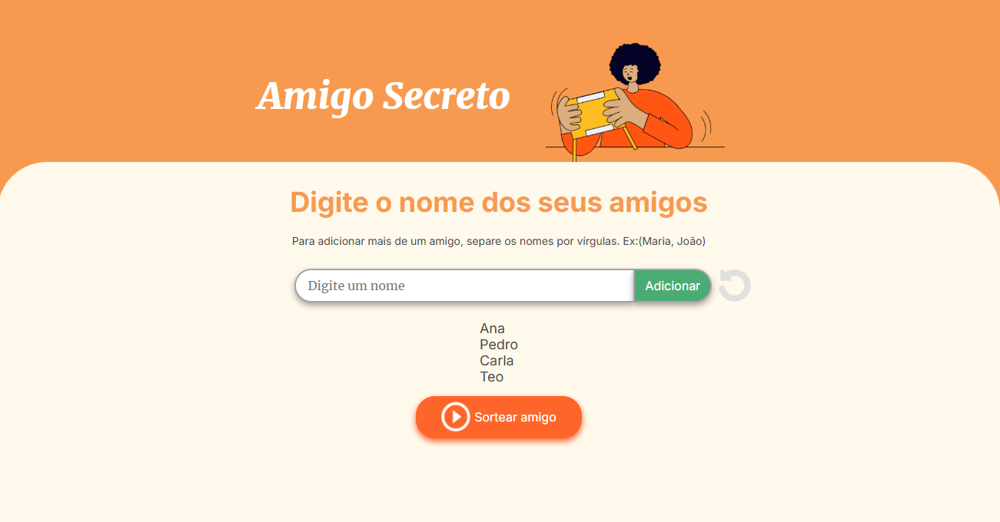

# Amigo Secreto

## Introdução

Este projeto é parte de um challenge do curso Oracle Next Education (ONE), realizado pela Oracle em parceria com a Alura, com o objetivo de capacitar talentos em tecnologia. Neste challenge, estamos criando uma aplicação web para realizar o sorteio de um amigo secreto.

Acesse a aplicação através deste [link](https://fervassoler.github.io/amigo-secreto/) do GitHub Pages!

## Como Executar o Projeto

### Pré-requisitos

- Navegador web atualizado
- Git instalado

### Instalação

1. Clone o repositório:
    ```bash
    git clone https://github.com/fervassoler/amigo-secreto
    ```
2. Navegue até o diretório do projeto:
    ```bash
    cd amigo-secreto
    ```
3. Abra a página inicial:
    - No Linux ou Mac:
    ```bash
    open index.html
    ```
    - No Windows:
    ```cmd
    index.html
    ```

## Telas da Aplicação

### Tela Inicial
#### Web | Mobile
 

### Tela com Lista de Amigos
#### Web | Mobile
 

### Tela Após Início do Sorteio
#### Web | Mobile
 

### Tela Após Limpar Resultados
#### Web | Mobile
 

## Funcionalidades

- **Adicionar Amigos:** 
  - Ao clicar em "Adicionar", o nome do amigo inserido no campo aparecerá em uma lista abaixo.
  - Se o campo de texto estiver vazio ou o nome já estiver na lista, um alerta pedirá para digitar um nome válido.
  - Se o nome contiver caracteres diferentes de letras, uma mensagem indicará que o nome é inválido.
  - Para adicionar mais de um amigo por vez, separe os nomes por vírgula (ex: ana, maria, joao).
  <br><br>

- **Sorteio Aleatório:** 
  - Ao clicar no botão "Sortear Amigo", um nome da lista será selecionado aleatoriamente e exibido na tela.
  - O sorteio termina quando todos os nomes da lista já tiverem sido sorteados.
  - Se o nome sorteado for o da própria pessoa, há a opção de resortear clicando no botão "Me sorteei".
  - Se o sorteio já tiver ocorrido ou não houver nenhum amigo adicionado, um alerta pedirá para adicionar os nomes dos amigos.
  <br><br>

- **Reiniciar:**
  - Ao clicar no ícone de reiniciar, a lista de amigos será resetada para iniciar novamente a adição dos nomes para o sorteio.
  <br><br>

- **Resortear:**
  - Ao clicar no botão "Me sorteei", será realizado um novo sorteio aleatório com os nomes restantes.
  <br><br>

- **Limpar Resultado:**
  - Ao clicar no botão "Limpar resultado", o nome sorteado será apagado da tela.
  <br><br>

## Tecnologias Utilizadas

-  
-  
- <i

## Descrição Técnica

### Estrutura de arquivos
    .
    ├── assets                                 # imagens usadas no projeto
    |   ├── amigo-secreto.png
    |   ├── play_circle_outline.png
    |   └── restart.svg
    ├── [app.js](#appjs)                        # script javascript que controla a aplicação
    ├── [index.html](#indexhtml)                # página inicial com estrutura html
    ├── [style.css](#stylecss)                  # folha de estilo usada no front-end
    └── [README.md]                            # README com a descrição do projeto


### [app.js](./app.js)

O arquivo [app.js](./app.js) contém a lógica principal da aplicação de sorteio de amigo secreto. Abaixo está uma descrição das principais funções e variáveis utilizadas:

#### Variáveis Globais
- `amigos`: Array que armazena a lista de amigos.
- `sorteioRealizado`: Booleano que indica se o sorteio já foi realizado.
- `toRemove`: String que armazena o nome do amigo a ser removido após o sorteio.
- `sorteado`: String que armazena o nome do amigo sorteado.

#### Funções

- **capitalizar(texto)**: Coloca a primeira letra de cada palavra em maiúscula.
- **validaCampoVazio(texto)**: Verifica se o campo está vazio.
- **validaDuplicado(amigo)**: Verifica se o amigo já foi adicionado à lista.
- **validaTrataInput(amigoInput)**: Valida e trata o input do usuário, verificando se o campo está vazio, se contém apenas letras e se o amigo já foi adicionado.
- **adicionarAmigo()**: Adiciona um amigo à lista, permitindo a adição de múltiplos amigos separados por vírgula.
- **sortearAmigo()**: Realiza o sorteio de um amigo da lista, garantindo que o sorteio não seja repetido e que o nome sorteado não seja o próprio.
- **resortearAmigo()**: Realiza um novo sorteio caso o nome sorteado seja o próprio.
- **atualizarListaAmigos()**: Atualiza a lista de amigos no HTML.
- **reiniciarAmigoSecreto()**: Limpa a lista de amigos e reinicia o sorteio.
- **ocultarResultado()**: Oculta o resultado do sorteio e reinicia a aplicação se todos nomes já tiverem sido sorteados.
- **limparElemento(elemento)**: Limpa o valor de um elemento HTML.
- **alterarValorElemento(elemento, valor)**: Altera o valor de um elemento HTML.

Essas funções trabalham juntas para fornecer a funcionalidade completa da aplicação de sorteio de amigo secreto, desde a adição de amigos até a realização e reinício do sorteio.


### [index.html](./index.html)

O arquivo [index.html](./index.html) contém a estrutura principal da aplicação de sorteio de amigo secreto. Abaixo está uma descrição das principais seções e elementos utilizados:

#### Estrutura do Documento

- **DOCTYPE e `<html>`**: Define o tipo de documento como HTML5 e especifica o idioma como português do Brasil (`pt-br`).
- **`<head>`**: Contém metadados e links para recursos externos, incluindo:
  - `<meta charset="UTF-8">`: Define a codificação de caracteres como UTF-8.
  - `<meta name="viewport" content="width=device-width, initial-scale=1.0">`: Configura a viewport para garantir a responsividade.
  - `<link rel="stylesheet" href="style.css">`: Link para a folha de estilos CSS.
  - Links para fontes do Google Fonts.
  - `<title>Amigo Secreto</title>`: Define o título da página.

#### Corpo do Documento (`<body>`)

- **`<main class="main-content">`**: Elemento principal que contém todo o conteúdo da aplicação.
  - **`<header class="header-banner">`**: Cabeçalho da aplicação contendo:
    - `<h1 class="main-title">Amigo Secreto</h1>`: Título principal da aplicação.
    - ``: Imagem representativa do amigo secreto.
  - **`<section class="input-section">`**: Seção de entrada de dados contendo:
    - `<h2 class="section-title">Digite o nome dos seus amigos</h2>`: Título da seção.
    - **`<div class="input-wrapper">`**: Contêiner para os elementos de entrada:
      - `<input type="text" id="amigo" class="input-name" placeholder="Digite um nome">`: Campo de entrada para digitar o nome do amigo.
      - `<button class="button-add" onclick="adicionarAmigo()">Adicionar</button>`: Botão para adicionar o amigo à lista.
      - ``: Ícone para reiniciar a lista de amigos.
    - `<ul id="listaAmigos" class="name-list" aria-labelledby="listaAmigos" role="list"></ul>`: Lista de amigos adicionados.
    - `<ul id="resultado" class="result-list" aria-live="polite"></ul>`: Lista para exibir o resultado do sorteio.
    - **`<div class="button-container">`**: Contêiner para os botões de ação:
      - `<button class="button-draw" onclick="sortearAmigo()" aria-label="Sortear amigo secreto">`: Botão para sortear um amigo.
        - ``: Ícone do botão de sorteio.
        - Texto do botão: "Sortear amigo".
      - **`<div id="hiden-elements" class="button-hidden-container hidden">`**: Contêiner para botões adicionais, inicialmente oculto:
        - `<button id="auto-sorteio" class="button-draw hidden-button" onclick="resortearAmigo()" aria-label="Sortear amigo secreto">`: Botão para resortear caso o próprio nome seja sorteado.
          - Texto do botão: "Me sorteei".
        - `<button id="limpar-resposta" class="button-draw hidden-button" onclick="ocultarResultado()" aria-label="Sortear amigo secreto">`: Botão para limpar o resultado do sorteio.
          - Texto do botão: "Limpar resultado".

#### Script

- **`<script src="app.js" defer></script>`**: Inclui o arquivo JavaScript [app.js](./app.js) que contém a lógica da aplicação, com o atributo `defer` para garantir que o script seja executado após o carregamento completo do HTML.

Essa estrutura HTML define a interface do usuário e a interação básica para a aplicação de sorteio de amigo secreto.

### [style.css](./style.css)

O arquivo [style.css](./style.css) contém os estilos utilizados na aplicação de sorteio de amigo secreto. Abaixo está uma descrição das principais seções e estilos definidos:

#### Variáveis CSS
- **`:root`**: Define variáveis de cores para uso em todo o documento.
  - `--color-primary`: Cor primária (#f79a4f).
  - `--color-secondary`: Cor secundária (#FFF9EB).
  - `--color-tertiary`: Cor terciária (#C4C4C4).
  - `--color-button`: Cor dos botões (#fe652b).
  - `--color-button-hover`: Cor dos botões ao passar o mouse (#e55720).
  - `--color-text`: Cor do texto (#444444).
  - `--color-white`: Cor branca (#FFFFFF).

#### Estilos Gerais
- **`*`**: Remove margens e preenchimentos padrão e define `box-sizing` como `border-box`.
- **`body`**: Define altura, cor de fundo, e centraliza o conteúdo usando flexbox.

#### Estrutura Principal
- **`.main-content`**: Define a estrutura principal com flexbox e direção de coluna.

#### Banner
- **`.header-banner`**: Estilos para o banner do cabeçalho, incluindo alinhamento, preenchimento e espaçamento.
- **`.header-banner img`**: Define tamanhos mínimos e máximos para a imagem do banner.

#### Seção de Entrada
- **`.input-section`**: Estilos para a seção de entrada, incluindo cor de fundo, bordas, alinhamento e preenchimento.

#### Títulos
- **`.main-title`**: Estilos para o título principal, incluindo fonte, tamanho, peso e cor.
- **`.section-title`**: Estilos para os títulos das seções, incluindo fonte, tamanho, peso e cor.

#### Contêineres de Entrada e Botão
- **`.input-wrapper`**: Define o contêiner para os elementos de entrada, incluindo alinhamento e largura.
- **`.input-name`**: Estilos para o campo de entrada de texto, incluindo preenchimento, bordas e tamanho da fonte.
- **`.button-container`**: Define o contêiner para os botões, incluindo alinhamento e largura.

#### Estilos de Entrada de Texto
- **`.input-title`**: Estilos para o título de entrada, incluindo preenchimento, tamanho da fonte, bordas e sombra.

#### Estilos de Botão
- **`button`**: Estilos gerais para botões, incluindo preenchimento, fonte, bordas, sombra e cursor.
- **`.button-add`**: Estilos específicos para o botão de adicionar, incluindo cor de fundo e bordas.
- **`.button-add:hover`**: Estilos para o botão de adicionar ao passar o mouse.

#### Listas
- **`ul`**: Remove o estilo padrão da lista e define a cor do texto e a fonte.
- **`.result-list`**: Estilos para a lista de resultados, incluindo margem, cor, tamanho da fonte e peso.

#### Botão de Sortear
- **`.button-draw`**: Estilos para o botão de sortear, incluindo alinhamento, cor de fundo, tamanho da fonte e espaçamento.
- **`.button-draw:hover`**: Estilos para o botão de sortear ao passar o mouse.

#### Botão de Reiniciar
- **`.button-restart`**: Estilos para o botão de reiniciar, incluindo tamanhos máximos e mínimos, margem e cursor.
- **`.button-restart:hover`**: Estilos para o botão de reiniciar ao passar o mouse.

#### Contêiner de Botões Ocultos
- **`.button-hidden-container`**: Define o contêiner para botões adicionais, incluindo alinhamento e margem.
- **`.hidden`**: Define a visibilidade oculta.
- **`.hidden-button`**: Estilos para botões ocultos, incluindo cor de fundo, tamanho da fonte e preenchimento.
- **`.hidden:hover`**: Estilos para botões ocultos ao passar o mouse.

#### Botão de Limpar Resposta
- **`#limpar-resposta`**: Estilos específicos para o botão de limpar resposta, incluindo cor de fundo.
- **`#limpar-resposta:hover`**: Estilos para o botão de limpar resposta ao passar o mouse.

Essa estrutura CSS define a aparência e o comportamento visual da aplicação de sorteio de amigo secreto.


## Contribuição

1. Faça um fork do projeto
2. Crie uma branch para sua feature:
    ```bash
    git checkout -b minha-feature
    ```
3. Commit suas mudanças:
    ```bash
    git commit -m 'Minha nova feature'
    ```
4. Faça um push para a branch:
    ```bash
    git push origin minha-feature
    ```
5. Abra um Pull Request